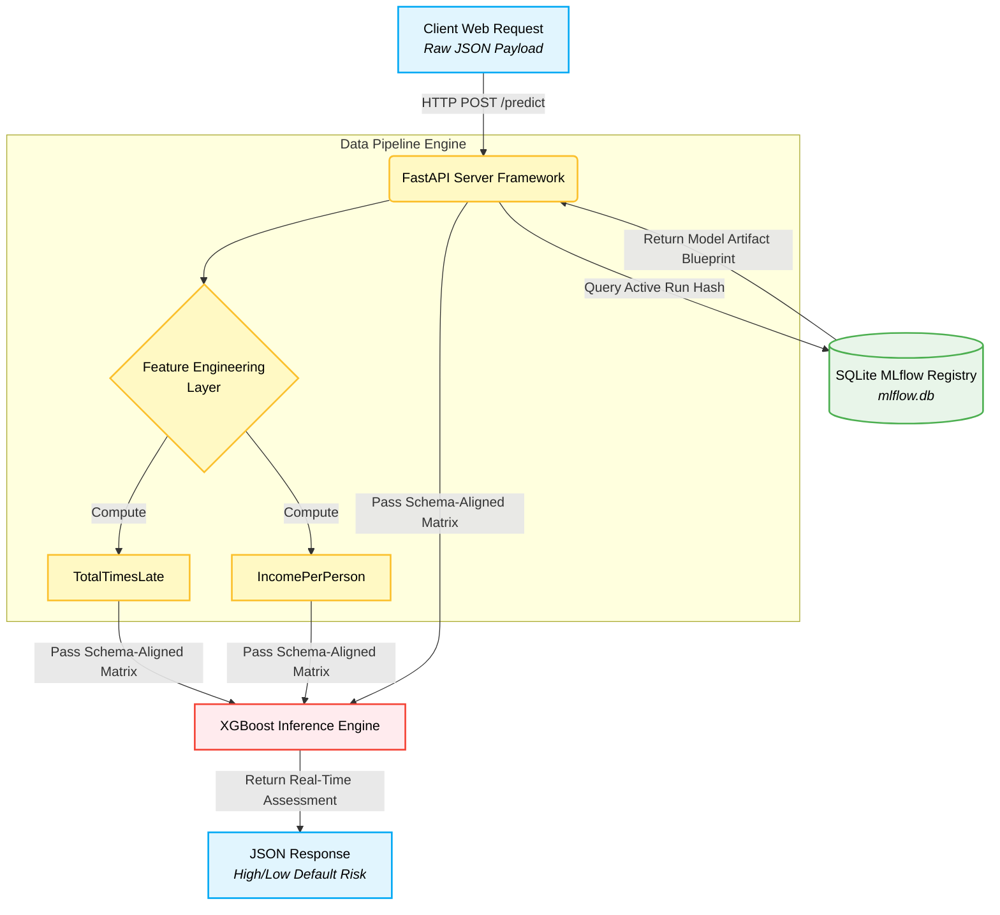

# Real-Time Credit Risk Inference Engine & MLOps Pipeline

An enterprise-grade, production-ready machine learning pipeline that trains an XGBoost classifier to assess credit default risk and serves predictions via a high-performance FastAPI backend. The architecture shifts away from traditional static file dependencies by dynamically querying an MLflow tracking database to serve the latest model version at runtime.

##️ Tech Stack & Trending Tools Used
* **Backend Framework:** FastAPI (Asynchronous Python Web Framework)
* **Machine Learning Framework:** XGBoost (Extreme Gradient Boosting)
* **MLOps & Experiment Tracking:** MLflow (Tracking Server with SQLite storage backend)
* **Data Engineering & Analysis:** Pandas, Jupyter Notebooks
* **Server Gateway:** Uvicorn (ASGI Server implementation)
* **Version Control:** Git & GitHub (Optimized for clean artifact management)

---

##  System Architecture




---

## Local Deployment Guide

### 1. Environment Setup
Clone the repository and install the production dependencies:
```bash
pip install -r requirements.txt #Install Dependencies

mlflow ui --backend-store-uri sqlite:///mlflow.db  #To launch MLFlow experiments UI

uvicorn app:app --reload   #Run server

#To send a mock credit application payload
curl -X POST "[http://127.0.0.1:8000/predict](http://127.0.0.1:8000/predict)" \
-H "Content-Type: application/json" \
-d '{
  "RevolvingUtilizationOfUnsecuredLines": 0.85,
  "age": 42,
  "NumberOfTime30-59DaysPastDueNotWorse": 2,
  "DebtRatio": 0.55,
  "MonthlyIncome": 4500,
  "NumberOfOpenCreditLinesAndLoans": 6,
  "NumberOfTimes90DaysLate": 1,
  "NumberRealEstateLoansOrLines": 1,
  "NumberOfTime60-89DaysPastDueNotWorse": 0,
  "NumberOfDependents": 2
}'
```
### 2.API Expected Output
```bash
#JSON
{
  "default_prediction": 1,
  "status": "High Risk of Default"
}
```

---
**Developer:** Swarna Rao  

[](https://www.linkedin.com/in/swarnamukhirchintalapudi)

**Focus:** Data Science | AI Strategy | Finance
