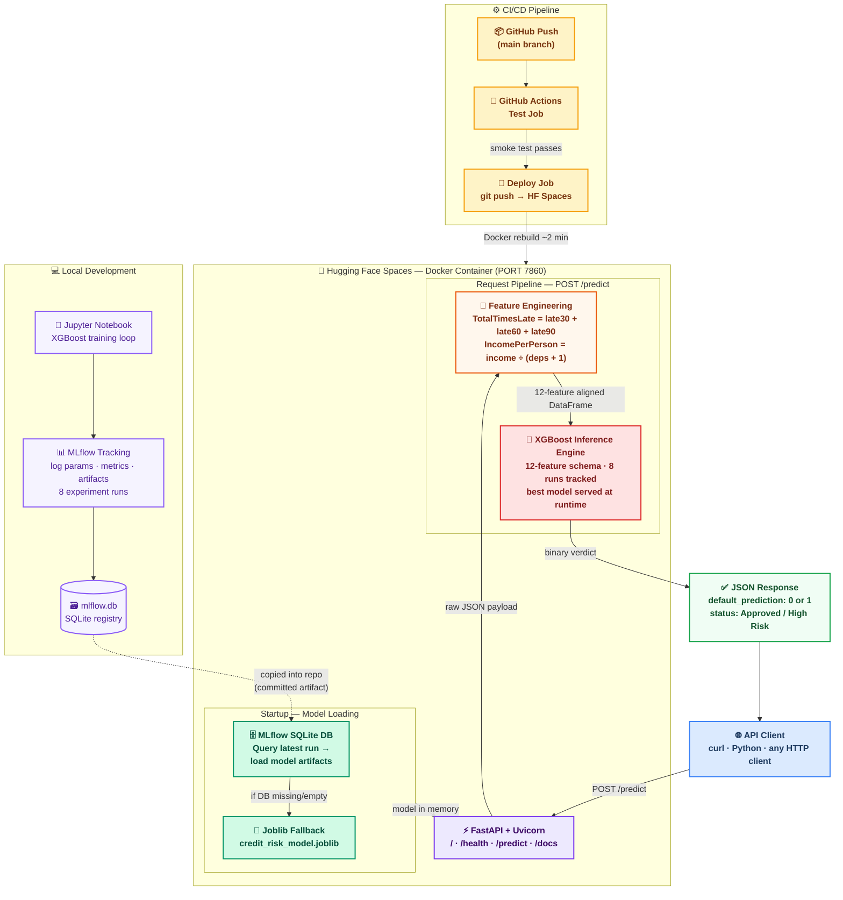

 

# 💳 Credit Risk Inference Engine
 
### Production MLOps pipeline — from raw applicant data to a live REST decision in milliseconds
 
[](https://fastapi.tiangolo.com)
[](https://xgboost.ai)
[](https://mlflow.org)
[](https://docker.com)
[](https://github.com/features/actions)
[](https://huggingface.co/spaces)
 
</div>
---
 
## What this does
 
Takes a raw JSON credit application, engineers two derived risk features on the fly, runs it through a trained XGBoost classifier, and returns a **binary default verdict** — all in a single `POST /predict` call. The model is loaded dynamically from MLflow's experiment registry at startup; if that fails, a joblib fallback takes over automatically. Zero downtime either way.
 
This is what a real MLOps pipeline looks like: not just a model — a fully orchestrated system with experiment tracking, versioned artifacts, containerised serving, and automated redeployment on every commit.
 
---
 
## System Architecture
 

 
---
 
## Stack
 
| Layer | Tool | Why |
|---|---|---|
| Model | XGBoost | State of the art on tabular credit data |
| Tracking | MLflow + SQLite | Logs every run; API queries DB at startup to serve latest best |
| Serving | FastAPI + Uvicorn | Async, auto-generates `/docs` Swagger UI, production-grade |
| Container | Docker | Reproducible, portable, no "works on my machine" |
| CI/CD | GitHub Actions | Tests on every PR, deploys on every merge to `main` |
| Hosting | HF Spaces | Free permanent URL, Docker-native, zero config |
 
---
 
## API Reference
 
### `GET /`
Basic liveness check.
 
```json
{
  "message": "Production Credit Risk API is live and running!",
  "interactive_docs": "/docs",
  "health_check": "/health"
}
```
 
### `GET /health`
Deep health check — verifies model is loaded and shows uptime, source, and config. Use this in CI smoke tests and monitoring.
 
```json
{
  "status": "healthy",
  "uptime_seconds": 42.3,
  "model_status": "loaded",
  "model_source": "joblib_fallback",
  "python_version": "3.11.9",
  "feature_count": 12
}
```
 
### `POST /predict`
Submit a credit application. Returns binary default prediction.
 
**Request:**
```json
{
  "RevolvingUtilizationOfUnsecuredLines": 0.85,
  "age": 42,
  "NumberOfTime30-59DaysPastDueNotWorse": 2,
  "DebtRatio": 0.55,
  "MonthlyIncome": 4500,
  "NumberOfOpenCreditLinesAndLoans": 6,
  "NumberOfTimes90DaysLate": 1,
  "NumberRealEstateLoansOrLines": 1,
  "NumberOfTime60-89DaysPastDueNotWorse": 0,
  "NumberOfDependents": 2
}
```
 
**Response:**
```json
{
  "default_prediction": 1,
  "status": "High Risk of Default"
}
```
 
> `TotalTimesLate` and `IncomePerPerson` are computed server-side — do not send them. The API derives them from raw inputs automatically.
 
---
 
## Run Locally
 
```bash
# Clone and install
git clone https://github.com/YOUR_USERNAME/credit-risk-model
cd credit-risk-model
pip install -r requirements.txt
 
# Start the API
uvicorn app:app --reload
# → http://127.0.0.1:8000/docs   (Swagger UI — try it in browser)
# → http://127.0.0.1:8000/health
 
# View all MLflow experiment runs
mlflow ui --backend-store-uri sqlite:///mlflow.db
# → http://127.0.0.1:5000
 
# Fire a test prediction
curl -X POST "http://127.0.0.1:8000/predict" \
  -H "Content-Type: application/json" \
  -d '{
    "RevolvingUtilizationOfUnsecuredLines": 0.85,
    "age": 42,
    "NumberOfTime30-59DaysPastDueNotWorse": 2,
    "DebtRatio": 0.55,
    "MonthlyIncome": 4500,
    "NumberOfOpenCreditLinesAndLoans": 6,
    "NumberOfTimes90DaysLate": 1,
    "NumberRealEstateLoansOrLines": 1,
    "NumberOfTime60-89DaysPastDueNotWorse": 0,
    "NumberOfDependents": 2
  }'
```
 
---
 
## How to verify everything is working
 
After deploying to Hugging Face Spaces, run these checks in order:
 
**1. Container built** — HF Spaces build logs show `Successfully built` with no red errors.
 
**2. Model loaded** — hit `/health` and confirm `"model_status": "loaded"`. This is the single most important signal.
```bash
curl https://YOUR_HF_USERNAME-YOUR_SPACE_NAME.hf.space/health
```
 
**3. Inference live** — a valid `POST /predict` returns a JSON verdict (not a 500 error).
 
**4. CI passed** — every merge to `main` shows a green checkmark in GitHub Actions → confirms smoke test hit `/` and got a 200 before deployment.
 
**If `/health` returns `"model_status": "FAILED"`** — the `credit_risk_model.joblib` wasn't copied into the image. Verify `COPY credit_risk_model.joblib .` is in your Dockerfile and the file is committed to git (check your `.gitignore` — `*.joblib` must be removed or the file force-added).
 
---
 
## CI/CD Flow

```mermaid
flowchart LR
    classDef trigger  fill:#fef3c7,stroke:#f59e0b,color:#78350f,font-weight:bold
    classDef job      fill:#dbeafe,stroke:#3b82f6,color:#1e3a5f,font-weight:bold
    classDef step     fill:#f0fdf4,stroke:#16a34a,color:#14532d
    classDef deploy   fill:#ede9fe,stroke:#7c3aed,color:#3b0764,font-weight:bold
    classDef live     fill:#fee2e2,stroke:#dc2626,color:#7f1d1d,font-weight:bold
 
    PUSH["📦 git push\nto main"]:::trigger
 
    subgraph GA["GitHub Actions"]
        direction TB
        T1["🧪 JOB 1 — Test\npip install -r requirements.txt"]:::job
        T2["▶️  uvicorn starts\non port 8000"]:::step
        T3["📡 curl / → assert 200\nsmoke test passes"]:::step
        D1["🚀 JOB 2 — Deploy\n(only if Test passes)"]:::deploy
        D2["git push → HF Spaces\nhuggingface remote"]:::step
        T1 --> T2 --> T3 --> D1 --> D2
    end
 
    HF["🤗 HF Spaces\ndetects push →\nrebuilds Docker image"]:::live
    LIVE["✅ Live endpoint\n~2 min build time"]:::live
 
    PUSH --> GA
    D2 --> HF --> LIVE
```
 

 
---

---
**Developer:** Swarna Rao  

[](https://www.linkedin.com/in/swarnamukhirchintalapudi)

**Focus:** Data Science | AI Strategy | Finance
