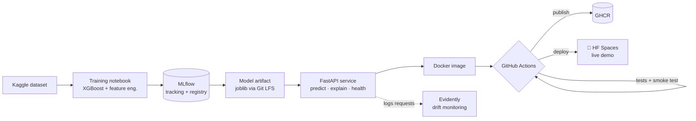

# 🏦 Credit Risk Inference API

**Production-style ML system for credit default prediction — XGBoost served via FastAPI, with MLflow experiment tracking, SHAP explainability, data drift monitoring, and a full CI/CD pipeline.**

[](https://github.com/SwarnaRao24/credit-risk-model/actions/workflows/ci.yml)
[](https://huggingface.co/spaces/SwarnaRao24/credit-risk-api)
[](https://github.com/SwarnaRao24/credit-risk-model/pkgs/container/credit-risk-model)
[](https://www.python.org/)

🔴 **Live API:** https://SwarnaRao24-credit-risk-api.hf.space/docs *(interactive Swagger UI)*

---

## What this project demonstrates

This is an end-to-end MLOps project, not just a model in a notebook. A loan application goes in; a risk decision, calibrated probability, and a SHAP-based explanation come out — served from a containerized API that is tested, built, published, and redeployed automatically on every push to `main`.

| Capability | Implementation |
|---|---|
| Model training & tuning | XGBoost classifier, feature engineering, class imbalance handling |
| Experiment tracking | MLflow (SQLite backend, model registry, run comparison) |
| Serving | FastAPI + Pydantic validation, Dockerized with non-root user |
| Explainability | SHAP TreeExplainer — per-prediction top risk factors via `/explain` |
| Monitoring | Evidently AI drift reports comparing live traffic vs. training reference |
| CI/CD | GitHub Actions: pytest → Docker smoke test → push to GHCR → auto-deploy to HF Spaces |
| Testing | Unit tests with mocked model, plus a real-container smoke test in CI |

## Model performance

Trained on the [Give Me Some Credit](https://www.kaggle.com/c/GiveMeSomeCredit) dataset (~150K loan applications).

| Metric | Score |
|---|---|
| **AUC-ROC (held-out test set)** | **0.8692** |

Two features were engineered on top of the 10 raw inputs: `TotalTimesLate` (sum of all delinquency counts) and `IncomePerPerson` (monthly income normalized by household size) — both rank among the model's top SHAP contributors.

## Architecture


```mermaid
flowchart LR
    A[Kaggle dataset] --> B[Training notebook<br/>XGBoost + feature eng.]
    B --> C[(MLflow<br/>tracking + registry)]
    C --> D[Model artifact<br/>joblib via Git LFS]
    D --> E[FastAPI service<br/>predict · explain · health]
    E --> F[Docker image]
    F --> G{GitHub Actions}
    G -->|tests + smoke test| G
    G -->|publish| H[(GHCR)]
    G -->|deploy| I[🤗 HF Spaces<br/>live demo]
    E -.->|logs requests| J[Evidently<br/>drift monitoring]
```

## Try it

Score a loan application against the live API:

```bash
curl -X POST https://SwarnaRao24-credit-risk-api.hf.space/predict \
  -H "Content-Type: application/json" \
  -d '{
    "RevolvingUtilizationOfUnsecuredLines": 0.72,
    "age": 31,
    "NumberOfTime30-59DaysPastDueNotWorse": 2,
    "DebtRatio": 0.65,
    "MonthlyIncome": 4200,
    "NumberOfOpenCreditLinesAndLoans": 9,
    "NumberOfTimes90DaysLate": 1,
    "NumberRealEstateLoansOrLines": 0,
    "NumberOfTime60-89DaysPastDueNotWorse": 0,
    "NumberOfDependents": 2
  }'
```

```json
{
  "default_prediction": 1,
  "default_probability": 0.6841,
  "risk_tier": "High",
  "status": "High Risk of Default",
  "action": "Declined",
  "engineered_features": { "TotalTimesLate": 3, "IncomePerPerson": 1400.0 },
  "latency_ms": 12.4
}
```

Ask **why** with the same payload against `/explain` — it returns the top 5 SHAP factors driving that specific decision, each tagged `increases_risk` or `reduces_risk`.

## API reference

| Endpoint | Method | Purpose |
|---|---|---|
| `/health` | GET | Liveness + model/SHAP status (used by CI smoke test) |
| `/predict` | POST | Risk score, tier (Low / Review / High), and decision |
| `/explain` | POST | Top 5 SHAP risk factors for one application |
| `/drift` | GET | Drift summary (current traffic vs. training reference) |
| `/drift/report` | GET | Full Evidently HTML drift report |
| `/docs` | GET | Interactive Swagger UI |

## Run it locally

```bash
git clone https://github.com/SwarnaRao24/credit-risk-model.git
cd credit-risk-model
git lfs pull                          # fetch the model artifact

# Option A — Docker (matches production exactly)
docker build -t credit-risk-api .
docker run -p 8000:8000 credit-risk-api

# Option B — pull the published image, zero build
docker run -p 8000:8000 ghcr.io/swarnarao24/credit-risk-model:latest

# Option C — bare Python
pip install -r requirements.txt
uvicorn app:app --reload
```

Then open http://localhost:8000/docs.

Run the tests:

```bash
pip install pytest && pytest tests/ -v
```

## Drift monitoring

Every `/predict` call appends its input features to `data/recent_requests.csv`. The API exposes this as a live endpoint rather than a script you have to remember to run:

```bash
curl https://SwarnaRao24-credit-risk-api.hf.space/drift
```

```json
{
  "drift_detected": false,
  "drifted_features": 4,
  "total_features": 12,
  "current_rows_checked": 36,
  "report_path": "drift_report.html"
}
```

`drift_detected` is Evidently's overall dataset-level verdict (a majority of features must drift for this to flip `true`); `drifted_features` shows how many individual columns drifted. The full visual report — per-feature distribution plots, drift scores, and a data quality summary — is at `GET /drift/report`. Needs at least 30 logged requests to run; returns `409` with a clear message until then. In a real production setting this would run on a schedule and gate retraining rather than being polled manually.

## CI/CD pipeline

Every push to `main` runs four stages in GitHub Actions:

1. **Test** — pytest suite with a mocked model (fast, no artifacts needed)
2. **Docker** — builds the real image, boots the container, polls `/health`, and fires a live `/predict` smoke test
3. **Publish** — pushes the image to GitHub Container Registry, tagged `latest` + commit SHA
4. **Deploy** — pushes to Hugging Face Spaces, which rebuilds the live demo automatically

The model artifact is versioned with **Git LFS**, and CI explicitly verifies it pulled the real binary rather than an LFS pointer (a failure mode this pipeline catches by design).

## Project structure

```
├── app.py                  # FastAPI service: /predict, /explain, /health, /drift
├── notebook.ipynb          # Training: EDA, feature eng., XGBoost + MLflow
├── monitor.py              # Evidently drift report generator (used by /drift)
├── create_reference.py     # Builds the drift reference dataset
├── promote_model.py        # MLflow model registry promotion
├── credit_risk_model.joblib# Trained XGBClassifier (Git LFS)
├── data/
│   ├── reference.csv       # 10K-row training sample, drift baseline
│   └── recent_requests.csv # Seed log; /predict appends here at runtime
├── Dockerfile
├── tests/                  # API unit tests (mocked model)
└── .github/workflows/ci.yml
```

## Model card

**Data.** Trained on Kaggle's [Give Me Some Credit](https://www.kaggle.com/c/GiveMeSomeCredit) dataset (~150K anonymized US consumer credit records, 2009-era). It is a public benchmark dataset, not real Scotiabank or any other institution's data, and was chosen specifically because its features (utilization, delinquency history, debt ratio) mirror what an actual retail credit risk model would consume.

**Decision thresholds.** The 0.35 / 0.60 probability cutoffs in `classify_risk()` were chosen by inspecting the precision/recall tradeoff in the notebook, not derived from a business cost-of-capital analysis — in a real deployment these would be set jointly with risk/compliance teams based on the bank's actual default cost vs. false-decline cost, and revisited as the portfolio changes.

**Calibration.** XGBoost's `predict_proba` output is not guaranteed to be a calibrated probability out of the box. The notebook does not apply isotonic or Platt calibration; treat `default_probability` as a relative risk ranking rather than "this applicant has exactly an 18% chance of default."

**Known limitations.**
- No fairness/disparate-impact testing across protected attributes — age is a model input, which is generally restricted in real consumer lending (ECOA/Reg B in the US, similar rules in Canada) without specific justification. In production this would need a fair-lending review before deployment, not after.
- Training data is over a decade old and US-specific; it does not reflect current Canadian credit behavior or post-2009 macroeconomic conditions.
- Drift monitoring here only covers feature drift (are inputs changing?), not label drift (is the relationship between features and actual default changing?) — the two are different failure modes, and this project only covers the first.

This section exists because shipping a model without naming its limitations is itself a red flag in regulated-industry ML — the model card is part of the deliverable, not an afterthought.

## Tech stack

Python 3.11 · XGBoost · scikit-learn · FastAPI · Pydantic · MLflow · SHAP · Evidently AI · Docker · GitHub Actions · Git LFS · Hugging Face Spaces

---

*Built by [Swarnamukhi Chintalapudi](https://github.com/SwarnaRao24) · [LinkedIn](https://www.linkedin.com/in/swarnamukhirchintalapudi) — Data Engineer transitioning into AI/ML Engineering.*